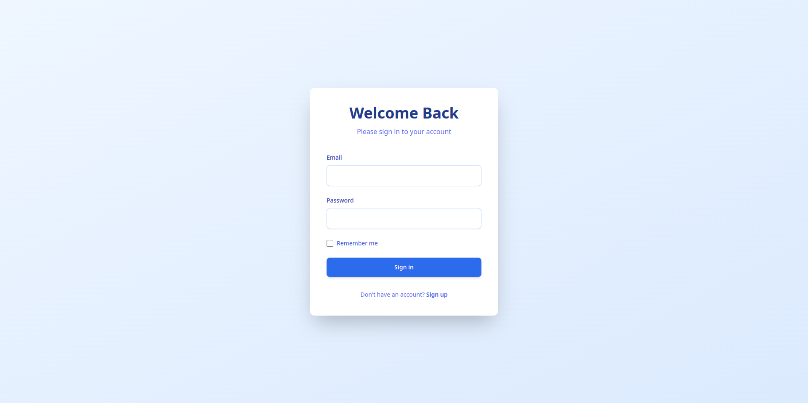
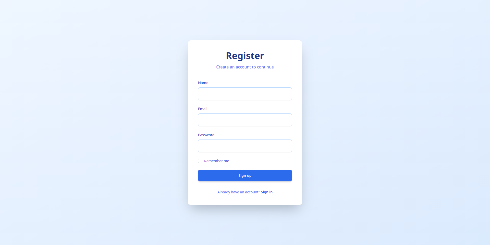
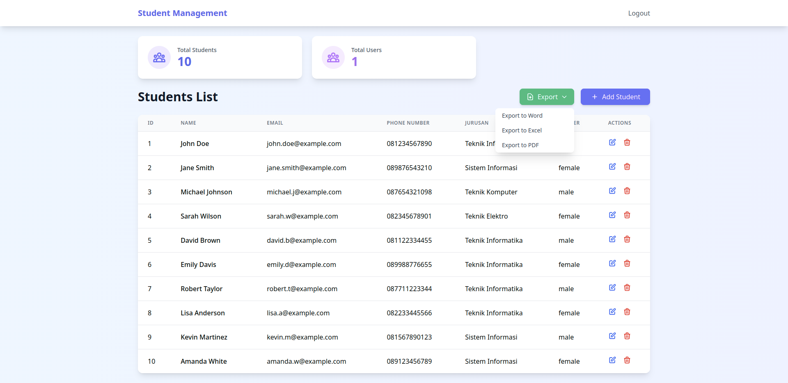

# Pemrograman Web - UAS Project
## _Students Managment_
This project is created to fulfill the final exam requirements for the "Pemrograman Web" course. It demonstrates the implementation of web development concepts learned throughout the semester.

[](https://travis-ci.org/ryotwell/pemrograman-web.uas)

## Project Description

A web application built using PHP that showcases fundamental "Pemrograman Web" concepts including:
- Database management
- CRUD operations
- User authentication
- Form handling
- Responsive design
- Export to PDF, Excel, and WORD

## Screenshots





## Team Members

1. ZULZARIO ZAERI - 220602030
2. M. TAUFIK HIFAYAT - 220602017 
3. NUR HAMID - 220602023

## Installation Steps

1. Clone the repository
```bash
git clone https://github.com/ryotwell/pemrograman-web.uas.git
cd pemrograman-web.uas
composer install
npm install
```
2. Configure database
- Update database credentials in the configuration file

3. Start local development server
```bash
php -S localhost:8000
```

## Access Application

Open your web browser and visit:
```bash
http://localhost:8000
```

## Requirements

- PHP 8.3 or higher
- MySQL 5.7 or higher
- Web browser (Chrome, Firefox, Safari)

## Project Structure

```bash
pemrograman-web.uas/
├── app/
│   ├── css/
│   ├── middleware/
│   ├── models/
│   └── views/
├── database.sqlite
├── public/
│   ├── css/
│   └── index.php
```

## License

This project is open-sourced under the MIT license.